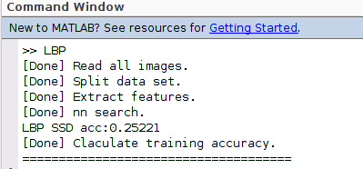

# **Plant Seeding Classification**

408125029 資工三 王禮芳

## 1. Method description

### 1.1 Read data

使用 `imageDataStore()` 讀取資料，本次作業使用兩個 image datastore，分別用於train和test資料夾：

```matlab
dataSet = imageDatastore("plant-seedlings-classification/train/", "IncludeSubfolders", true, "LabelSource", "foldernames", "FileExtensions", ".png");
testSet = imageDatastore("plant-seedlings-classification/test/", "FileExtensions", ".png");
```

使用的參數：

* `"IncludeSubfolders", true` ：表示讀進資料時，也會讀進底下的紫資料夾
* `"LabelSource", "foldernames"`：表示資料的標籤就是其所在資料夾名稱
*  `"FileExtensions", ".png"`：表示我們要收納的檔案是 .png 檔

參考的用法：https://www.mathworks.com/help/matlab/ref/matlab.io.datastore.imagedatastore.readimage.html

### 1.2 Split data set

使用 `splitEachLabel()` 切分資料集：

```matlab
[trainSet, valSet] = splitEachLabel(dataSet, 0.5, "randomized");
```

將 dataSet 這個 datastore 以每個label按照0.5的比例，分成兩個 datastore trainSet 與 valSet。

使用的參數：

* `0.5`：表示切分比例
* `"randomized"`：表示資料是隨機被切分的

參考的用法：https://www.mathworks.com/help/matlab/ref/matlab.io.datastore.imagedatastore.spliteachlabel.html

### 1.3 Extract feature

使用 local binary pattern：

```matlab
trainFeature = zeros(trainNum, 59);
for i=1:trainNum
     tmp = readimage(trainSet,i);
     tmp = rgb2gray(tmp);
     features = extractLBPFeatures(tmp);
     trainFeature(i,:) = features;
end


valFeature = zeros(valNum, 59);
for i=1:valNum
     tmp = readimage(valSet,i);
     tmp = rgb2gray(tmp);
     features = extractLBPFeatures(tmp);
     valFeature(i,:) = features;
end
```

`extractLBPFeatures()` 會將二維的圖片，擷取其特徵成 `1*59` 的陣列，我們分別建立 train 與 validation 的特徵集，準備送去 nn search 找到最近鄰居。

這個部份是整個程式裡跑最久的。

參考的用法：https://www.mathworks.com/help/vision/ref/extractlbpfeatures.html#namevaluepairarguments

### 1.4 NN search

使用 `knnsearch()`：

```matlab
resIdx = knnsearch(trainFeature, valFeature);
```

會回傳一組 index，內容是 trainFeature 從頭開始，在 valFeature 裡最接近的那一筆 feature（亦即，若 index 第一個元素是 a ，那最靠近第一個 valFeature 特徵的，就是 trainFeature 裡的第 a 筆資料）。

參考的用法：https://www.mathworks.com/help/stats/knnsearch.html

### 1.5 Accuracy

暴力地從頭開始檢查我們給 trainFeature 資料裡配對的 label 是否正確：

```matlab
matchNum = min(trainNum, valNum);
correctCnt = 0;
for i=1:matchNum
    if (trainSet.Labels(resIdx(i)) == valSet.Labels(i))
        correctCnt = correctCnt + 1;
    end
end
acc = correctCnt / matchNum;
```

### 1.6 Export .csv File

最後，我們還要把 train + val 的資料重新對 test 做一次，並將分類結果輸出成 `.csv` 檔案：

```matlab
output = strings(testNum, 2);
output(1, 1) = "file";
output(1, 2) = "species";
for i=1:testNum
    [img,info] = readimage(testSet, i);
    [filepath,name,ext] = fileparts(info.Filename);
    fileName = string(name) + string(ext);
    output(i+1, 1) = fileName;
    output(i+1, 2) = dataSet.Labels(resIdx(i));
end
writematrix(output, "submission.csv");
```

首先要先建立 matrix，才能使用 `writematrix()` 把這個 matrix 輸出存成 `.csv` 檔。第一欄表頭規定是 "file" 與 "species"，而中間我們使用 `readimage()` 、`fileparts()` 讀出檔案名稱。

參考的用法：https://www.mathworks.com/help/matlab/ref/writematrix.html#d124e1675718

## 2. Experimental results
### 2.1 Validation accuracy



準確率只有2成5。

### 2.2 Kaggle result


測試資料的結果，準確率是2成7。

## 3. Discussion

這次報告使用 LBP 分類植物，準確度滿不理想的， 和其他同學相互比較的結果也是我的準確度偏低。我想這有兩個原因，一是我沒有對照片做任何前置處理（能力也不足），二是 LBP 可能不太適合拿來這樣做。

但關於各類特徵擷取方法的物理意義以及每種的實做方法，我可能還不太熟悉，所以這部份能夠討論的也很有限。

## 4. Problem and difficulties

這次作業的重點應該是放在如何使用內建的函數擷取植物特徵，並以內建函數做 NN search。然而我反而覺得這是本次作業最簡單的地方，由於這些擷取的方法已經提供名稱，且上課都有介紹，我們能夠很容易地透過搜尋關鍵字，找到可以使用的函數與使用方法。

然而，上課沒有說的，像是如何讀取整個資料夾的資料、怎麽幫資料註記 Label 、怎麽把圖片從 datastore 中弄出來存去做處理、怎麼把最後結果輸出成 `.csv` 等等，查找這些資料以及思索該如何使用，反而佔據了這次作業絕大多數的時間。不知道該搜尋什麽關鍵字、不斷在 matlab answers 與 stackoverflow 徘徊無果，加之每次程式都執行很久，這次作業可說是在焦慮無法如期完成的情況下寫出來的。

但可能也是因為這是研所開設的課程，這些困擾我整整兩個禮拜的問題對修課同學來說都是基礎到不行的一碟小菜。

### 4.1 資料如何讀取與儲存、上 Label

我第一版的 code 不是用 image datastore拿出資料，而是打算開 string array 記錄整個檔案的全名稱，並以機產生亂數的方式作為切分資料集的 idx ，但這樣做不但使程式碼又臭長，我也容易錯亂，而且對於如何給這些「檔名」加上 Label 毫無頭緒，根本是拿磚頭雜自己的腳。

後來經過同學開導使用 image datastore，這是一個紀錄多個檔案資訊的物件，還能為檔案以資料夾名稱上 Label ，最後終於成功寫出本次作業，這大概也算是作為一種解決方式吧。

### 4.2 如何進行 `knnsearch()`

讀過官方文件後，發現範例都是使用一維資料互相比較、找出最近鄰居，但作業面對是二維的圖片，這使我煩惱許久該如何解決。曾經尋求錯誤的解答方向，不斷上網尋找是否有給高維資料的 NN search 方法，當然也是無功而返。

後來發現只要使用擷取特徵的函式，這些特徵就會是一維的資料，我們也就可以直接送進去做 knnsearch，而甚至是原圖片，其實處理的方法也就只是把2維壓成1維就好。

